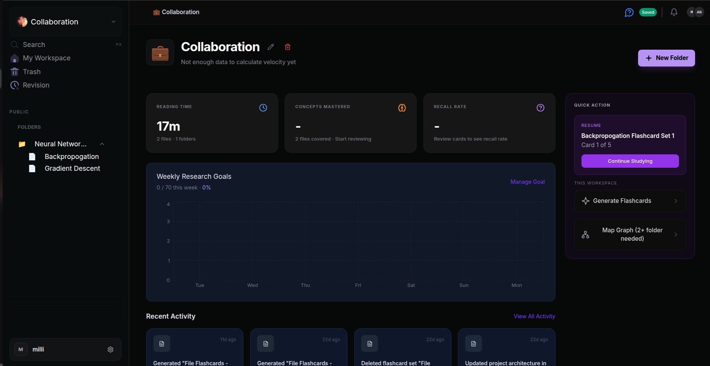
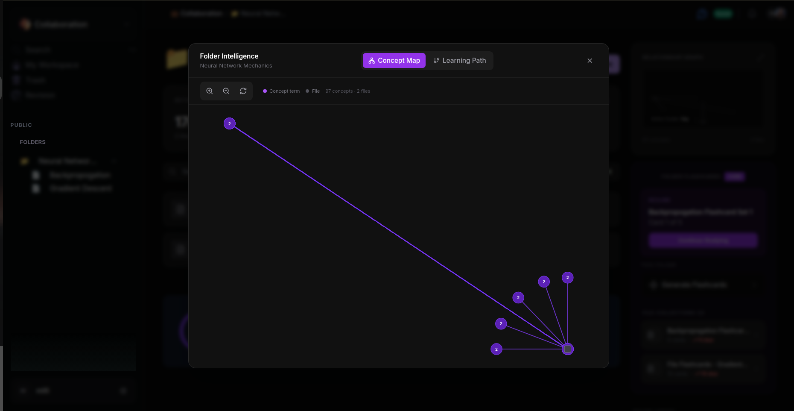
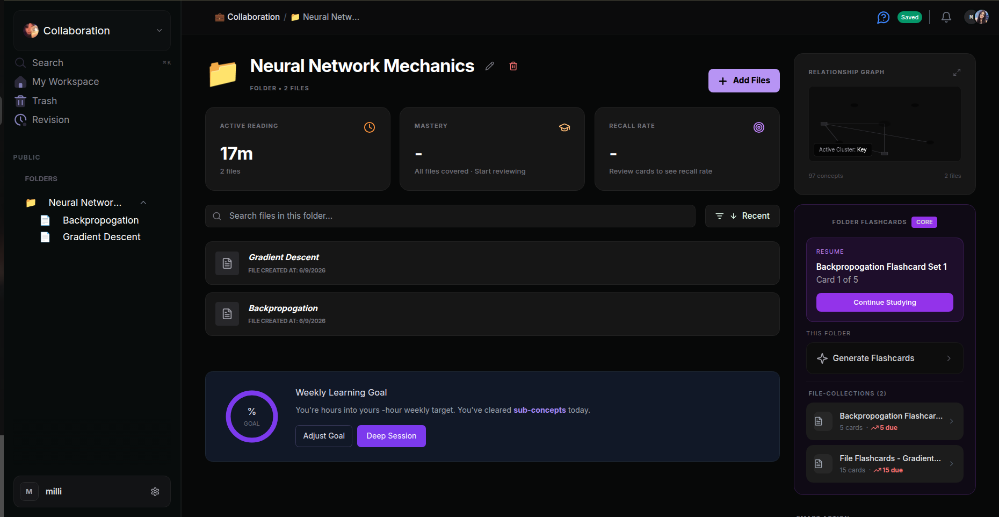
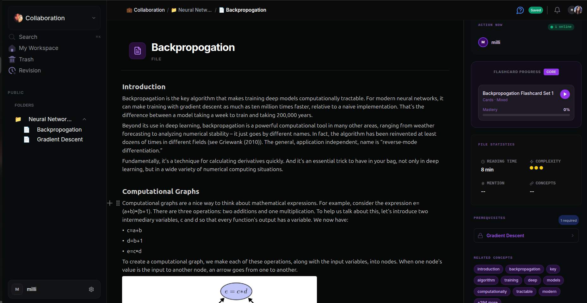
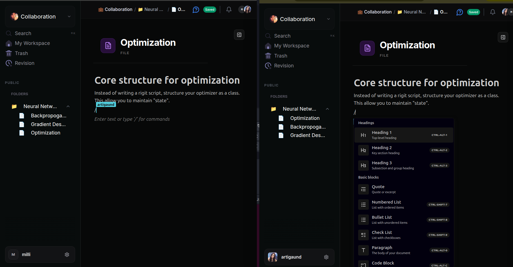
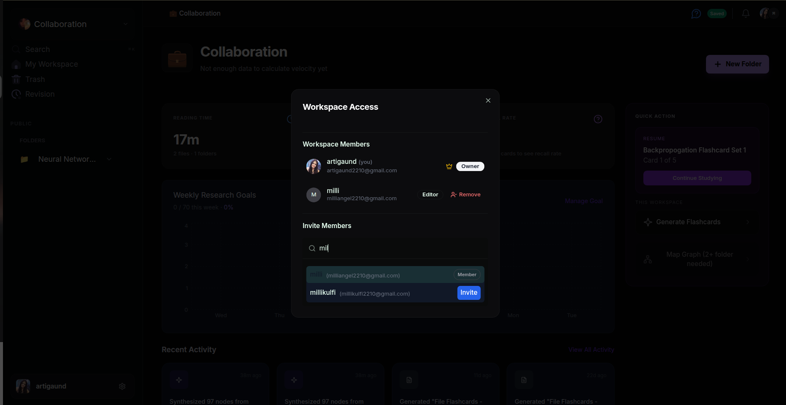
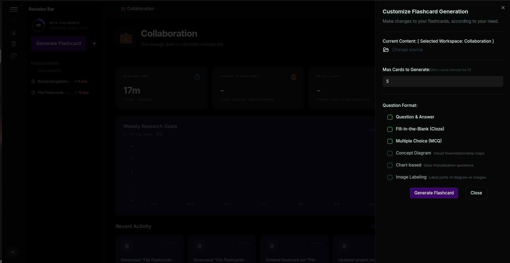
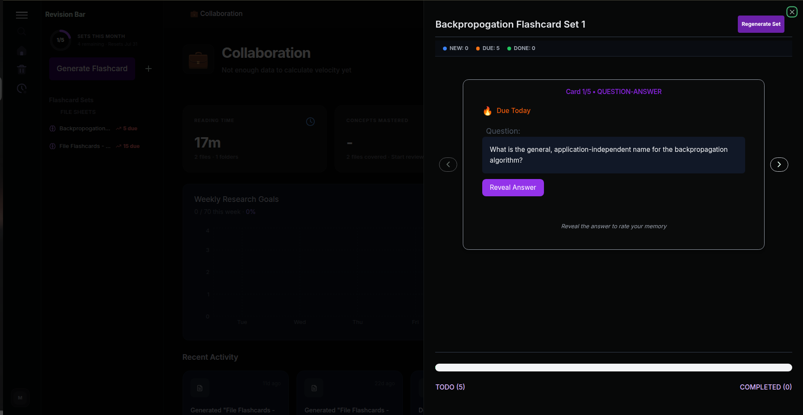
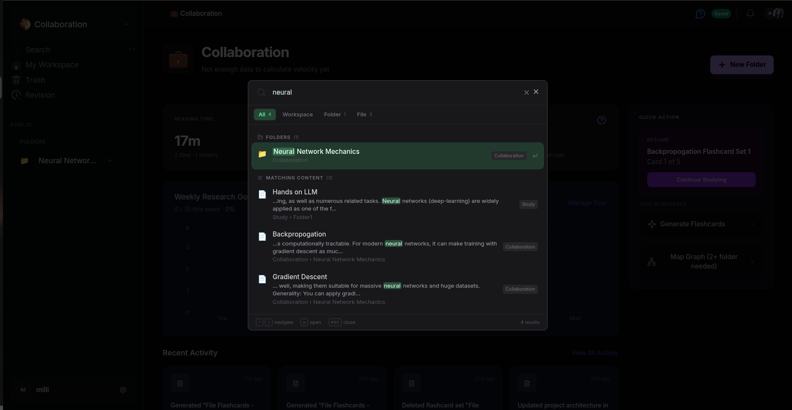
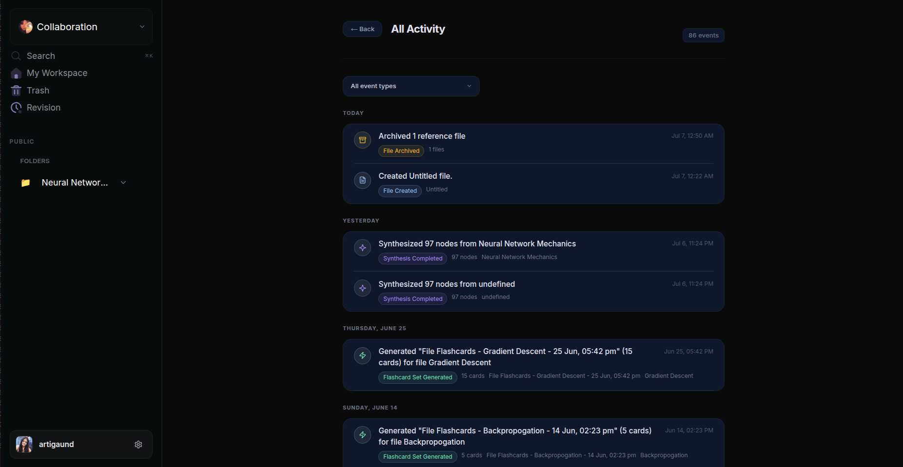

# StudySprout 🌱

> A Collaborative workspace for learning — write your own notes or drop in a PDF, and get AI-generated flashcards, spaced repetition, and automatic concept mapping either way.

[](https://studysprouts.vercel.app)
[](https://nextjs.org/)
[](https://www.typescriptlang.org/)
[](https://www.mongodb.com/)
[](https://redis.io/)

**[Live Demo](https://studysprouts.vercel.app)** · **[Report a Bug](https://github.com/ArtiGaund/studysprout/issues)** · **[Contact](mailto:artigaund2210@gmail.com)**
**Companion repo:** [`studysprout-realtime-server`](https://github.com/ArtiGaund/studysprout-realtime-server) — the standalone Socket.io + Yjs service that powers live collaboration, presence, and generation locking. Deployed and versioned separately; see its own README for the deep socket-architecture detail.

---

## Overview

Most students and researchers end up with a folder full of PDFs and scattered notes, and no real system for retaining what's in them. StudySprout is a collaborative, Notion-style workspace — write pages directly in a block-based editor, or upload a PDF and let it get parsed into structured pages for you. Either way, every file gets pulled into the same intelligence layer: terms get indexed, concepts get mapped across the folder, prerequisite relationships get detected, and AI-generated flashcards turn the content into something you actually study from, with spaced repetition tracking whether it's sticking.

It's organized as **workspaces containing folders containing files** — workspaces can be public (open to invited collaborators) or private — and unlike most note apps, every layer is instrumented with learning intelligence instead of just being a place to dump text.

---

## Why I Built This

I wanted a tool that didn't just store notes but actively helped me figure out *what to read, in what order, and whether I'd actually retained it*. Off-the-shelf note apps are good at storage and bad at retrieval. Anki is good at flashcards and bad at organizing source material. StudySprout tries to close that gap by connecting the source document, the extracted concepts, the generated flashcards, and the review data into one loop.

---

## Core Features

### ✍️ File Creation & Editing
- Files aren't only produced by PDF extraction — users can create a file from scratch at any point in a folder and write directly into it, exactly like a Notion page
- Block-based editor (BlockNote): headings, bullet/numbered lists, code blocks, tables, images, math blocks, slash commands
- These manually-created files go through the **same intelligence pipeline** as PDF-derived files: term extraction, concept graph inclusion, prerequisite detection, flashcard generation, and reading-time estimation all run on user-written content too, not just parsed PDFs
- Because manual files and PDF-derived files share the same underlying block schema, a folder can freely mix both — e.g. a PDF-derived chapter sitting next to a page of the user's own typed notes, and the concept graph treats them identically

### 📄 PDF → Structured Content
- Custom structural parser (Python: `pdfplumber`, `pikepdf`, `pdftoppm`/poppler, `PyMuPDF`, `pillow`) that detects headings, lists, tables, code blocks, and math zones instead of just dumping raw text
- Decodes CID-encoded fonts and merges sentence fragments broken across PDF line breaks
- Splits a single PDF into multiple topic-scoped files automatically, using page-based chunking so one PDF becomes 15-20 well-scoped files rather than one unreadable document
- Extracts embedded images and preserves them inline

### 🧠 Concept Graph
- **Folder-level graph**: surfaces terms that appear across 2+ files in a folder and visualizes them as a concept ↔ file network (D3-rendered, draggable, zoomable)
- **Workspace-level graph**: two flavors —
  - a similarity graph showing which folders/subjects share concepts (useful for discovery)
  - a directed prerequisite graph showing learning order between subjects (e.g. *Linear Algebra → Quantum Mechanics*)
- Built from a workspace-wide term index that's incrementally rebuilt via a background worker whenever files change

### 🔗 Prerequisite Detection
- Automatic, zero-AI-cost detection: if File B uses terms that are only defined/introduced in File A, File A is flagged as a prerequisite of File B
- Runs automatically for PDF-derived folders; triggerable on-demand ("Analyze Folder") for manually-created folders
- Manual override system so users can add/remove prerequisite links the algorithm gets wrong
- File-level prerequisites are aggregated upward into folder-level "you should learn X before Y" relationships

### 🗂️ Flashcards & Spaced Repetition
- AI-generated flashcards (Gemini) at both the file level and the folder level ("folder-wide synthesis" sets)
- SM-2-style spaced repetition scheduling based on recall performance
- Per-file and per-folder mastery scores, recall rate, and review history
- Generation is on-demand — folders without a flashcard set yet show a clear "Generate Flashcards" call to action rather than an empty/broken state

### 📊 Learning Analytics
- Active reading time (auto-estimated from block/word count, with a multiplier for math-heavy content)
- Mastery percentage and recall rate, calculated from real flashcard review sessions, not static placeholders
- Weekly research/learning goals with progress tracking
- Workspace-level "research velocity" and concept-mastery counts aggregated across all folders

### 🗃️ Workspace Organization
- Workspace → Folder → File hierarchy
- **Public/shared workspaces**: a workspace can be made public so multiple users can join and collaborate on the same folders, files, and flashcard sets — not just single-user notebooks
- **Role-based access**: each workspace has an Owner (the creator) and can invite other users as Editors by email, with a dedicated "Workspace Access" panel to add, view, and remove members
- Per-workspace monthly flashcard generation limits (e.g. "1/5 sets this month, resets on the 31st"), enforced with an atomic `findOneAndUpdate` + `$expr` check so concurrent requests can't race past the cap
- Global search across workspace name, folders, and file content simultaneously (single search box returns matching folders and matching file excerpts with highlighted terms, scoped by result type: All / Workspace / Folder / File), and clicking a result navigates directly to that exact file
- Workspace settings: rename, custom logo upload, and workspace/account deletion with explicit destructive-action confirmation
- Offline-capable shell (custom service worker + offline fallback page) — full offline editing is planned for a later release

### 👥 Real-Time Multi-User Collaboration
- Multiple users can be in the **same file at the same time**, live-editing together with changes appearing instantly on both sides
- Live presence shown in an "Action Now" panel (who's online, avatar, name)
- Concurrent editing is conflict-free — powered by **Yjs CRDTs** synced over **Socket.io** (handled by the separate [`studysprout-realtime-server`](https://github.com/ArtiGaund/studysprout-realtime-server)), so two people typing in the same document merge automatically instead of one overwriting the other
- Presence and content updates are pushed via dedicated socket events rather than polling
- Workspace invitations use a generic `Notification` model with pending/accepted/rejected states

### 🔒 Real Concurrency Control (not just "collaboration")
Real-time collaboration also means handling the moments where two people try to do the *same* thing at once:
- **Title-editing lock**: if two users try to rename the same folder, file, or flashcard set simultaneously, an active-editing presence state is broadcast so only one edit is in flight, preventing clashing renames
- **Flashcard generation lock**: if two users trigger flashcard generation for the same file or folder at the same time, the second request is denied via a live lock — including hierarchical checks (a folder-level generation blocks its child files from generating, and vice versa), with a 5-minute "ghost lock" auto-release in case a client disconnects mid-generation
- Both mechanisms exist to prevent wasted AI calls, corrupted in-progress flashcard sets, and confusing UI states when multiple people are actively working in the same workspace

### 🎯 Customizable Flashcard Generation
- Users can configure generation before running it: source scope (whole folder vs. a single file), number of cards, and question format
- Supported formats: Question & Answer, Fill-in-the-Blank (Cloze), Multiple Choice, Concept Diagram (visual relationship maps), Chart-based, and Image Labeling
- Study/review mode tracks cards as **New / Due / Done** per session, with reveal-to-rate spaced-repetition flow and a running progress bar
- Each file also surfaces its **prerequisites** directly in the side panel (locked until the prerequisite file is studied) and a **related concepts** tag list pulled from the term index

---

## Screenshots

**Workspace Dashboard** — reading time, concepts mastered, recall rate, weekly research goals, and quick actions at a glance


**Concept Graph** — auto-generated map of related terms across a folder's files, expandable into a full "Folder Intelligence" view with a Concept Map / Learning Path toggle


**Folder View** — per-folder analytics (active reading, mastery, recall rate), a folder-level relationship graph, and folder-wide flashcard sets


**File Editor** — block-based writing surface with live flashcard progress, file statistics, locked prerequisites, and related concept tags in the side panel


**Real-Time Collaborative Editing** — two users in the same file at once; typed content and slash-command menus sync instantly between sessions via Yjs + Socket.io


**Workspace Access & Roles** — invite collaborators by email, assign Owner/Editor roles, and manage who has access to a shared workspace


**Customizable Flashcard Generation** — choose the source (file or whole folder), card count, and question format (Q&A, Cloze, MCQ, Concept Diagram, Chart-based, Image Labeling)


**Flashcard Review** — spaced-repetition study session with New / Due / Done tracking and a reveal-to-rate flow


**Global Search** — search across workspace names, folders, and file content simultaneously, with matches highlighted inline


**Activity Log** — a running history of every meaningful action in a workspace (files created, flashcards generated, concept graphs synthesized)


---

## Tech Stack

**Frontend**
- Next.js 14 (App Router)
- TypeScript
- Tailwind CSS
- BlockNote (rich text editor)
- D3.js (graph visualization)
- Yjs (CRDT for collaborative editing)

**Backend**
- Next.js API routes (Node.js runtime)
- MongoDB + Mongoose
- Redis + BullMQ (background job queues — three queues: `pdf-processing`, `file-sync-queue`, `term-index-rebuild`)
- Socket.io — real-time events for collaborative editing and presence, run as an **independent server** ([`studysprout-realtime-server`](https://github.com/ArtiGaund/studysprout-realtime-server), separate repo and deployment) so real-time connections aren't limited by serverless function timeouts
- Yjs — CRDT layer for conflict-free concurrent document editing

**AI / Intelligence Layer**
- Google Gemini API — flashcard generation, folder concept synthesis
- Custom Python PDF pipeline — `pdfplumber`, `pikepdf`, `pdftoppm` (poppler), `PyMuPDF`, `pillow`
- Custom term extraction (stop-word filtering, tokenization, markdown/noise stripping)
- Custom prerequisite detection (regex-based whole-word term matching against a workspace term index — no LLM call needed)

**Infrastructure**
- Vercel (Next.js app: frontend + API routes)
- Railway (background workers — same repo, separate deployment; and the standalone realtime server)
- MongoDB Atlas, single shared Redis instance across all three services
- Cloudinary (PDF & image storage)

---

## Architecture

### Deployment topology — three services, two repos

```
┌──────────────────────┐         ┌──────────────────────────────┐
│   Vercel               │         │   Railway                       │
│   Next.js App           │◄───────┤   studysprout-realtime-server     │
│   (this repo)           │  HTTP  │   (separate repo)                │
│   Pages + API routes    │───────►│   Socket.io + Yjs                │
└──────────┬─────────────┘  emit   └───────────────┬───────────────────┘
           │                                        │
           │ enqueue jobs                  enqueue  │ file-sync jobs
           ▼                                        ▼
    ┌───────────────────────────────────────────────────┐
    │              Shared Redis (BullMQ)                   │
    └───────────────────────┬────────────────────────────────┘
                             │ consumed by
                             ▼
              ┌─────────────────────────────────┐
              │   Railway                          │
              │   studysprout background workers     │
              │   (this repo, different start          │
              │    command via nixpacks.toml)           │
              │   PDF processing · file sync ·           │
              │   term index rebuilds                     │
              └───────────────┬─────────────────────────┘
                              │
                              ▼
                    ┌──────────────────┐
                    │  MongoDB Atlas     │
                    └──────────────────┘
```

**Why three services from two repos:** the Next.js app is request/response and serverless — perfect for pages and API routes, but structurally unable to host long-running processes. Background workers (BullMQ consumers, the Python PDF subprocess pipeline) and the always-on Socket.io server both need to stay alive continuously, which serverless can't do — so those run on Railway instead. The worker service is the *same* `studysprout` codebase as the Vercel app, deployed a second time with a different entry point (`workers/index.ts`, invoked via `nixpacks.toml` instead of `next start`).

**How the pieces talk to each other:**
- Vercel API routes enqueue jobs directly into shared Redis — no direct call to the worker needed
- The realtime server debounces live Yjs edits (2s) and pushes `persist-file` jobs to the same Redis queue
- The worker continuously polls those queues, processes jobs, writes to MongoDB
- After processing, the worker makes an outbound HTTP call to the realtime server's `/emit/*` endpoints so connected browsers get instant live updates
- Vercel API routes also call those same `/emit/*` endpoints directly for things like workspace invitations
- Nobody calls the worker directly — it has no public URL and receives all its work via the Redis queue

### PDF Processing Pipeline

```
Upload PDF → Cloudinary
   → BullMQ job enqueued
   → Python structural parser (headings, tables, math, images)
   → Page-based chunking into multiple topic files
   → Convert each chunk to BlockNote (Yjs) document
   → Extract terms per file → mark workspace term index stale
   → Background worker rebuilds term index (debounced, every 30s)
   → Concept graph + prerequisite detection run in parallel
     (Promise.allSettled — one failing doesn't block the other)
   → Real-time socket events notify the UI as each file completes
```

### Real-Time Collaboration Layer

The editor is not single-player. Any file can have multiple people editing it concurrently:

```
User A types → Yjs local update → Socket.io broadcast → User B's Yjs doc merges update
                                                        → User B's editor re-renders (no conflict)
```

- **Yjs** handles the actual conflict resolution (CRDT) — there's no "last write wins" or locking; both users' edits are preserved and merged deterministically
- **Socket.io** is the transport, handled by the standalone [`studysprout-realtime-server`](https://github.com/ArtiGaund/studysprout-realtime-server) — see that repo for the full socket-event breakdown, presence architecture, and generation-lock implementation
- Presence (who's currently viewing/editing) is tracked separately from document content, so "online" indicators update instantly even if no edits are being made
- Concurrency isn't just "edits merge" — see [Real Concurrency Control](#-real-concurrency-control-not-just-collaboration) above for the title-lock and generation-lock mechanisms that prevent two users from colliding on the same action

### Term Index & Concept Graph

The system maintains a workspace-wide `termIndex`: a map of `term → [fileIds that contain it]`. This one structure powers three separate features:

1. **Concept graphs** — terms appearing in 2+ files become graph nodes
2. **Prerequisite detection** — if file B's text contains a term that's "defined" (indexed) in file A, A becomes a prerequisite candidate for B
3. **Folder/workspace relationship graphs** — aggregating shared terms (or aggregating file-level prerequisite edges) up to the folder level produces subject-to-subject relationships

Rebuilds are debounced: file saves just flip a `termIndexStale` boolean, and a repeatable BullMQ job checks every 30 seconds for stale workspaces and rebuilds them — so rapid successive edits collapse into a single rebuild instead of one per keystroke.

---

## Notable Technical Decisions

**Why chunk PDFs into multiple files instead of one long document?**
A 100-page PDF as a single file is unstudyable. Page-based chunking produces files that are actually digestible study units, and it lets the concept graph/prerequisite system operate at a useful granularity (file-to-file, not just page-to-page).

**Why regex term-matching instead of an LLM call for prerequisites?**
Cost and speed. Every file would need to be checked against every other file's terms — doing that with an LLM call per pair is both slow and expensive at scale. A term-index lookup is O(n) and instant, and it turned out to be "good enough" (70–80% accurate) with a manual-override system to fix the rest.

**Why Yjs instead of a simpler locking model for the editor content itself?**
Multiple users can be editing the same file at once. Locking would mean one person blocks everyone else; CRDTs let edits merge automatically without a central authority deciding who "wins." (Locking is still used, deliberately, for *discrete* actions like renaming or flashcard generation — see [Real Concurrency Control](#-real-concurrency-control-not-just-collaboration) — because those aren't mergeable the way text content is.)

**Why deploy the realtime server as a separate repo instead of folding it into the main app?**
Vercel (serverless) cannot host a process that holds WebSocket connections open continuously. Splitting it into its own repo/service, deployed on Railway, was the only way to get always-on real-time behavior without moving the entire app off Vercel.

**Why fire-and-forget logging + a single `emitServerRealtimeEvent` convention?**
Early on, sockets were double-emitting events from multiple code paths. Standardizing on a single emit helper and auditing every socket call site fixed a class of bugs where the UI would flicker or apply the same update twice.

---

## Project Structure

```
studysprout/
├── src/
│   ├── app/
│   │   ├── api/
│   │   │   ├── folder/[folderId]/     # analyzer, flashcards, prerequisites
│   │   │   ├── workspace/[workspaceId]/ # stats, folder-graph, prerequisite-graph
│   │   │   └── file/                    # sync, upload, last-studied
│   │   ├── dashboard/                  # main authenticated app
│   │   └── (auth)/                     # sign in / sign up
│   ├── components/
│   │   ├── editor/                     # BlockNote wrapper, presence
│   │   ├── graphs/                     # D3 concept/prerequisite/relationship graphs
│   │   └── ui/
│   ├── lib/
│   │   ├── workers/                    # syncWorker, pdfWorker, workspace-term-index
│   │   ├── bullmq/                     # queue, redis-connection
│   │   ├── model/                      # Mongoose schemas
│   │   └── services/                   # business logic reused by API routes + workers
│   ├── utils/
│   │   ├── pdf/                        # structural parser, chunker, sanitizer
│   │   └── intelligence/               # term extractor, concept graph, prerequisites, SRS
│   └── store/                          # Redux slices + selectors
├── python/                             # requirements.txt: pdfplumber, pikepdf, PyMuPDF, pillow
├── workers/
│   └── index.ts                        # standalone entry point for Railway worker deployment
├── nixpacks.toml                       # Railway build config (Node + Python + poppler)
└── public/
```

---

## Getting Started

### Prerequisites
- Node.js 18+
- MongoDB 5+
- Redis 7+
- Python 3.9+ (PDF parsing)

### Environment Variables

```bash
MONGODB_URI=mongodb://localhost:27017/studysprout
REDIS_URL=redis://localhost:6379

GEMINI_API_KEY=your_gemini_key

CLOUDINARY_CLOUD_NAME=your_cloud_name
CLOUDINARY_API_KEY=your_api_key
CLOUDINARY_API_SECRET=your_api_secret

NEXTAUTH_SECRET=your_secret
NEXTAUTH_URL=http://localhost:3000

NEXT_PUBLIC_REALTIME_URL=http://localhost:4000
```

### Setup

```bash
git clone https://github.com/ArtiGaund/studysprout.git
cd studysprout

npm install
pip install -r python/requirements.txt

# Terminal 1 — Next.js app
npm run dev

# Terminal 2 — background workers (PDF, term index, file sync)
npm run worker:start

# or run everything in one terminal:
npm run dev:all
```

You'll also want [`studysprout-realtime-server`](https://github.com/ArtiGaund/studysprout-realtime-server) running locally for full functionality — live collaboration, presence, and generation locks won't work without it. See that repo's README for setup.

### Deployment
- **Next.js app** → Vercel, deployed from this repo normally
- **Background workers** → Railway, deployed from this *same* repo with `nixpacks.toml` overriding the start command to `npm run worker:start`
- **Realtime server** → Railway, deployed from the separate [`studysprout-realtime-server`](https://github.com/ArtiGaund/studysprout-realtime-server) repo

---

## Current Status & Roadmap

**Shipped**
- PDF upload → structured multi-file extraction
- Folder & workspace concept graphs
- Automatic + manual prerequisite detection
- Flashcards (file-level & folder-level) with SRS
- Reading time, mastery, and recall analytics
- Real-time collaborative editor with title-editing and flashcard-generation locks
- Workspace invitations & notifications
- Full production deployment across Vercel + Railway (two repos, three services)

**In Progress / Next**
- [ ] Full offline mode (service worker + local sync)
- [ ] Mobile-responsive app views (currently desktop-first)
- [ ] Anki-compatible flashcard export
- [ ] Team/multi-user analytics

---

## What I Learned Building This

- Designing a background-job system (BullMQ) so that expensive operations (PDF parsing, concept graph builds, term index rebuilds) never block the request/response cycle, and fail independently of each other
- Debugging CRDT-based collaborative editing, including an echo-back bug where the editor's hydration effect re-broadcast a client's own full document state as if it were a live incremental update — corrupting merged documents for other clients until traced back to a single redundant `socket.emit` call
- Building real concurrency control for a multi-user product — not just "edits merge," but discrete-action locking (title edits, flashcard generation) with hierarchical checks and crash-safety timeouts
- Enforcing usage limits (monthly flashcard generation caps) safely under concurrency — using MongoDB's atomic `findOneAndUpdate` with `$expr` comparisons instead of a read-then-write pattern that could race
- Splitting one codebase across two deployment platforms (Vercel + Railway) based on which parts need to run continuously versus which are request/response, and keeping Redis/Mongo/env vars consistent across three independently deployed services
- The cost/accuracy tradeoff between LLM-based and heuristic approaches to structured-data extraction (why prerequisite detection uses plain term matching, but flashcard generation uses Gemini)
- Auditing an entire real-time system for duplicate event emissions and parameter mismatches after they caused UI state to desync

---

## Related Repositories

- **This repo** — Next.js app, API routes, background workers, PDF pipeline, concept graph, flashcards
- **[`studysprout-realtime-server`](https://github.com/ArtiGaund/studysprout-realtime-server)** — Socket.io + Yjs collaboration server, presence tracking, generation/title locks

## Contact

**Arti Gaund**
[LinkedIn](https://linkedin.com/in/artigaund) · [Email](mailto:artigaund2210@gmail.com) · [GitHub](https://github.com/ArtiGaund)

---

Built solo, end to end — parsing pipeline, real-time backend, deployment architecture, analytics, and UI.